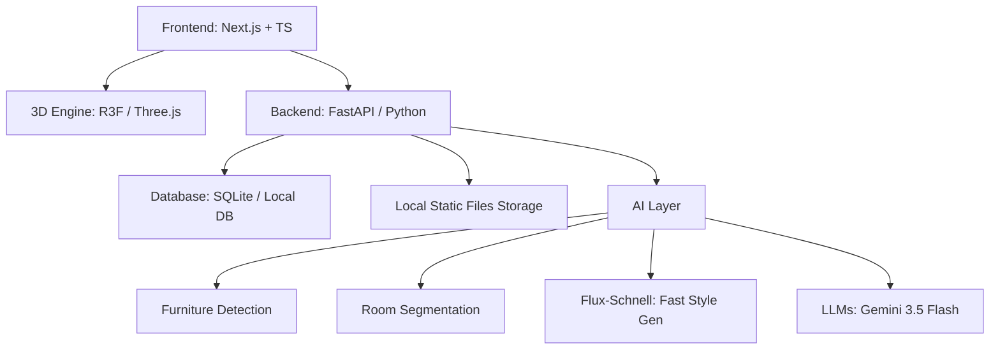

# HomeVerse

> **"Transform any room into a personalized, AI-powered living space."**

[](https://nextjs.org/)
[](https://docs.pmnd.rs/react-three-fiber)
[](https://fastapi.tiangolo.com/)
[](https://sqlite.org/)
[](https://deepmind.google/technologies/gemini/)
[](https://pollinations.ai/)

HomeVerse is an AI-powered interior design and room customization web application. It allows users to upload a photo of a room, receive multiple AI-generated redesigns in seconds, edit the room in an interactive 3D environment, and customize materials, furniture, and styling with the help of an AI Design Copilot.

The platform is designed to be highly extensible, with future expansion pathways into architecture, renovation planning, furniture e-commerce, AR visualization, and smart home integration.

---

## 🌟 Vision & Differentiator

Think of HomeVerse as:
**Canva + Figma + ChatGPT + Planner5D for Interior Design**

Unlike typical AI design apps that stop at static image generation, HomeVerse transitions the generated design into a **fully interactive, editable 3D design studio**.

```
Original Room Photo
       ↓
AI Room Segmentation & Style Generation (5 variations)
       ↓
Select a Design
       ↓
Interactive 3D Design Studio (Customize, Edit, chat with AI Copilot)
       ↓
High-quality Render, Walkthrough & Shopping Guide
```

---

## 🗺️ Core User Journey

### Step 1: Upload & Capture
Users upload, capture a photo, or record/upload a video walkthrough of their space:
* Living Room
* Bedroom
* Kitchen
* Office

### Step 2: AI Analysis
Behind the scenes, HomeVerse executes:
1. **Object Detection**: Identifies physical items like sofas, tables, TVs, beds, lights, cabinets, and decor.
2. **Segmentation**: Isolates boundaries of walls, floor, ceiling, windows, and doors.
3. **Room Understanding**: Constructs a semantic map of the 3D space.
4. **Style Generation**: Generates 5 aesthetic variations.

### Step 3: Generate Designs
Within seconds, the original room is transformed into 5 distinct styles:
* **Modern**
* **Luxury**
* **Scandinavian**
* **Minimalist**
* **Japandi**

```
┌────────┐ ┌────────┐
│Style 1 │ │Style 2 │
└────────┘ └────────┘

┌────────┐ ┌────────┐
│Style 3 │ │Style 4 │
└────────┘ └────────┘

     Style 5 (Featured)
```

### Step 4: Enter Design Studio
By clicking **"Open in Design Studio"**, the user enters an interactive 3D environment powered by Three.js where objects are selectable and editable.

#### Interactive Objects Context Context:
* **Furniture**: Customize Color, Material, Size, Position, Rotation, Replace, or Delete.
* **Wall**: Paint Color, Wallpaper, Texture, Material.
* **Floor**: Tiles, Wood, Marble, Granite.

---

## 🤖 AI Design Copilot & Features

### AI Design Copilot
A conversational sidebar allows users to modify the room using natural language:
* *User*: "Make this room brighter"  
  *AI Copilot*: *Adds larger windows, changes wall color to off-white, and adds warm lighting.*
* *User*: "Replace sofa with luxury furniture"  
  *AI Copilot*: *Updates the 3D scene with premium leather sofa and accents.*
* *User*: "Make this suitable for a study room"  
  *AI Copilot*: *Inserts a wooden bookshelf, a minimalist desk, and an adjustable desk lamp.*
* *User*: "Add a 4x5 bedroom extension"  
  *AI Copilot*: *Adds a navigable custom room slab with built-in doorway opening.*

### Direct Local Storage (Cloud-Free)
To ensure maximum speed, data ownership, and seamless offline capability, HomeVerse saves uploaded photos and designs directly to the local disk at `static/uploads/`, eliminating high latency and dependencies on Cloudinary or AWS S3.

### Dynamic 3D Room Additions
Users can dynamically add new rooms to their active floor plan simply by telling the Copilot their desired dimensions (e.g., *"add a 5x4 kitchen"*). HomeVerse constructs a custom 3D Room entity with floor geometry and 4 walls containing an integrated front doorway cutout, allowing natural navigation during walkthroughs.

### Expanded Minimalist Furniture Library
The Studio features a wide collection of minimalist furniture assets:
* **Seating**: Sofa, Armchair, Pouf/Ottoman, Dining Bench, Accent Stool, Bar Stool
* **Tables**: Coffee Table, Desk, Console Table, Dining Table
* **Storage**: Bookshelf, Nightstand, Wardrobe, Sideboard
* **Decor**: Planter Box, Wall Mirror, Floor Rug, Lamp, Window, Door, Partition Wall

### Smart Furniture Marketplace
Clicking any object in the 3D scene reveals a marketplace panel with:
* Similar real-world product suggestions
* Price comparison and direct purchase links
* Exact dimensions for compatibility checks

### 🎮 3D Walkthrough Mode
Step inside the designed space with video game controls:
* **Movement**: `WASD` / Arrow keys
* **Camera**: Mouse-look / Touch drag
* **Collision Detection**: Real-time bounding box collision checks prevent walking through walls or placed furniture.

---

## 🏗️ Technical Architecture



### Frontend
* **Core Framework**: Next.js (TypeScript)
* **Styling**: TailwindCSS, Shadcn UI
* **State Management**: React Query
* **Performance**: Prefetching preloader pre-fetches Pollinations AI redesign suggestions in parallel for instant style swapping.

### 3D Engine
* Three.js, React Three Fiber (R3F), Drei

### Backend
* **Core API**: FastAPI (Python)
* **Database**: SQLite (SQLAlchemy ORM)
* **Asset Storage**: Direct Local disk storage

### AI Layer
* **Design Generation**: Pollinations AI using **Flux-Schnell** model (generates variations in ~1.4 seconds)
* **AI Copilot**: Gemini 3.5 Flash (intent parsing, object additions/updates/deletions, and structural room generation)

---

## 📂 Project Structure

```
HomeVerse/
├── frontend/             # Next.js & Three.js client application
│   ├── src/
│   │   ├── app/
│   │   │   ├── page.tsx          # Landing & Upload page
│   │   │   ├── studio/
│   │   │   │   └── page.tsx      # 3D Design Studio Page
│   │   │   ├── globals.css       # Style sheets
│   │   │   └── layout.tsx        # App layout wrapper
│   │   ├── components/
│   │   │   └── studio/
│   │   │       ├── CanvasContainer.tsx       # 3D R3F Room Viewport
│   │   │       ├── ObjectPropertiesPanel.tsx # Object configurator sidepanel
│   │   │       └── CopilotChat.tsx           # AI chat sidepanel
│   └── package.json
│
├── backend/              # FastAPI Python server application
│   ├── main.py           # Application entrypoint
│   ├── requirements.txt  # Project Python dependencies
│   └── app/
│       ├── config.py     # Settings manager
│       ├── api/          # Route routers
│       │   ├── auth.py
│       │   ├── projects.py
│       │   ├── designs.py
│       │   └── ai.py
│       ├── db/           # Connection sessions & ORM aggregation
│       ├── models/       # SQLAlchemy models
│       ├── schemas/      # Pydantic validation schemas
│       └── services/     # AI service clients
```

---

## 🚀 Getting Started

### Prerequisites
* **Python**: `v3.10` or higher
* **Node.js**: `v18.0` or higher

### 1. Backend Setup (FastAPI)
1. **Navigate to the Backend Directory**:
   ```bash
   cd backend
   ```
2. **Activate the Virtual Environment**:
   * **Windows (PowerShell)**:
     ```powershell
     .\venv\Scripts\Activate.ps1
     ```
   * **macOS / Linux**:
     ```bash
     source venv/bin/activate
     ```
3. **Install Dependencies**:
   ```bash
   pip install -r requirements.txt
   ```
4. **Configuration**:
   Create a `.env` file in the `backend/` directory:
   ```env
   GEMINI_API_KEY=your-api-key-here
   ```
5. **Run the Backend Server**:
   ```bash
   python main.py
   ```
   The backend server will run on [http://localhost:8080](http://localhost:8080).

### 2. Frontend Setup (Next.js)
1. **Navigate to the Frontend Directory**:
   ```bash
   cd ../frontend
   ```
2. **Install Node Modules**:
   ```bash
   npm install
   ```
3. **Start the Development Server**:
   ```bash
   npm run dev
   ```
   The frontend application will serve on [http://localhost:3000](http://localhost:3000).

---

## 🗄️ Database Schema Design

### `Projects`
* `id` (UUID, PK)
* `title` (VARCHAR)
* `room_type` (VARCHAR)
* `thumbnail` (VARCHAR)
* `structural_analysis` (TEXT)
* `created_at` (TIMESTAMP)

### `Designs`
* `id` (UUID, PK)
* `project_id` (UUID, FK)
* `style` (VARCHAR)
* `image_url` (VARCHAR)
* `selected` (BOOLEAN)

### `Objects`
* `id` (UUID, PK)
* `design_id` (UUID, FK)
* `object_type` (VARCHAR)
* `position_x` / `position_y` / `position_z` (FLOAT)
* `rotation` (FLOAT)
* `scale` (FLOAT)
* `material` (VARCHAR)

---

## 📅 Project Timeline

Here is a chronological overview of the development lifecycle for **HomeVerse**:

### 📦 Phase 1: Core 3D Viewer & MVC (Week 1–2) — Completed
* Established Next.js + TypeScript client repository and FastAPI python server framework.
* Configured SQLite ORM databases to hold 3D objects, designs, and user project metadata.
* Built basic React Three Fiber 3D studio viewport rendering simple furniture boxes.
* Coded pointer lock WASD controls for the interactive walk-around simulation mode.

### 🌟 Phase 2: Decoupling & Speed Optimizations (Week 3–4) — Completed
* Decoupled AWS S3 and Cloudinary storage services, moving image processing directly to local server storage on disk.
* Optimized Pollinations AI generation pipelines, transitioning from traditional diffusion models to **Flux-Schnell** to cut image generation to **~1.4 seconds**.
* Implemented hidden background pre-loader hooks in the browser to pre-render redesign options instantly.
* Scaled up the room scanner preview columns from standard box sizing to broad full-width frames.

### 🏠 Phase 3: Architectural Additions & Custom Rooms (Week 5) — Completed
* Created custom 3D Room entities dynamically rendering adjacent walls, floors, and doorway entrances.
* Integrated regex room dimension parser in the Copilot engine to support commands like *"add a 4x4 room"*.
* Introduced a property dropdown switching between Independent House and Flat, disabling multi-floor selection for apartments.
* Implemented a collection of 13 new minimal furniture types.
* Integrated keydown listeners for Backspace and Delete to remove selected objects on the fly.

### 👥 Phase 4: Collaborative Design & Realism (Week 6+) — Planned
* Immersive WebXR mobile AR viewer integrations.
* Real-time co-designing multiplayer editor workspaces using WebSocket connections.
* Automated invoice exports mapping furniture selections.

---

## 👥 About the Author

HomeVerse was designed, developed, and optimized by:

**Anisha Paturi**
* **GitHub**: [@AnishaPaturi](https://github.com/AnishaPaturi)
* **Project Repository**: [GitHub - AnishaPaturi/HomeVerse](https://github.com/AnishaPaturi/HomeVerse)

Feel free to open an issue or submit a pull request if you want to collaborate!
