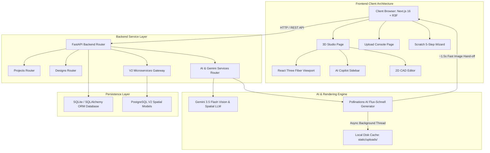

# HomeVerse

> **"Transform any room into a personalized, AI-powered 3D living space in seconds."**

[](https://nextjs.org/)
[](https://docs.pmnd.rs/react-three-fiber)
[](https://fastapi.tiangolo.com/)
[](https://sqlite.org/)
[](https://deepmind.google/technologies/gemini/)
[](https://pollinations.ai/)

---

## 🎯 Problem Statement & Market Gap

Traditional interior design and room renovation suffer from steep friction points across three major domains:

1. **The Static Image Limitation**: Most existing AI design tools generate 2D flattened concept images. While visually attractive, these static renders are un-editable "hallucinations." Users cannot move a sofa by 30cm, change wall colors independently, test floor tiles, or measure exact clearance distances between items.
2. **High Cost & Complexity Barrier**: Professional 3D interior CAD software (e.g., AutoCAD, SketchUp, 3ds Max) requires steep learning curves, expensive software licenses, and manual 3D modeling skills. Homeowners and renters are forced to hire costly interior consultants ($2,000–$10,000+) just to visualize simple room upgrades.
3. **Disconnection Between Design & Commerce**: Traditional mood boards do not map items to real-world dimensions or available catalog products. Users often fall in love with an AI concept image only to realize the furniture doesn't fit their physical room dimensions or isn't available for purchase.

---

## 💡 The Complete Idea & Core Vision

**HomeVerse** bridges the gap between 2D AI generative models and interactive 3D CAD environments. Think of HomeVerse as **Canva + Figma + ChatGPT + Planner5D for Spatial Interior Design**.

```
Upload Photo / Video / Blueprint / LiDAR
                  │
                  ▼
   AI Spatial Reconstruction Scan
   (Isolates walls, floor bounds, light vectors & furniture nodes)
                  │
                  ▼
   Dynamic Style & Choice Configuration
   (Select or type custom room types & design style themes)
                  │
                  ▼
   On-Demand Parallel Rendering & Layout Assembly
   (Fast ~1.5s CDN hand-off & background async image caching)
                  │
                  ▼
   Interactive 3D Design Studio Space
   (Three.js/R3F Viewport: Drag/drop 3D objects, paint walls, edit materials)
                  │
                  ▼
   AI Design Copilot & Smart Marketplace
   (Natural language modification, live pricing & CAD exporters)
```

Instead of stopping at static renders, HomeVerse extracts 3D spatial coordinates, room geometry, and material specifications to reconstruct a **Structured Digital Twin** inside an interactive WebGL viewport.

---

## 🚀 Complete Functionality & Feature Matrix

### 1. Multi-Modal Room Capture & Reconstruct Consoles
* **2D Image Upload**: Upload any PNG or JPG room photograph.
* **Video Walkthrough Scan**: Upload MP4 room video walkthroughs for spatial boundary extraction.
* **LiDAR Phone Scan Simulation**: Simulated real-time solid-state LiDAR point cloud scanner with vertex counters, HUD diagnostics, and scanning reticles.
* **Floorplan Blueprint Vectorizer**: Upload top-down house architectural blueprints. Automated AI tracing detects wall boundaries, room partitions, and labels spatial zones (*Bedroom Zone, Study Zone, Closet Zone*).

### 2. "Start from Scratch" 5-Step House Wizard
* **Step 1: House Details**: Select between Apartment/Flat or Independent House. Input bedrooms, bathrooms, balconies, main door facing direction (Vastu/Feng Shui compliant), total dimensions, doors, windows, and target room to modify.
* **Step 2: Room Blueprint & Budget Tiering**: Auto-crop room blueprints from full floorplans, set exact room length/width (meters), and select budget tiers (*₹5L Friendly, ₹10L Economy, ₹20L Premium, ₹50L Luxury, or Custom*).
* **Step 3: Master House JSON Model**: Compiles and validates a structured JSON spatial schema representing the home's architectural parameters.
* **Step 4: Locked-Layout Parallel Style Generation**: Triggers 6 parallel renders sharing identical 3D furniture coordinates while applying 6 distinct material style profiles simultaneously (*Modern, Japandi, Scandinavian, Minimalist, Modern Luxury, Industrial, Contemporary*).
* **Step 5: Interactive 4-Wall Perspective Preview**: Preview generated room styles from multiple camera angles (*Door View, Opposite View, Left Wall, Right Wall*) before entering studio space.

### 3. Interactive 3D Design Studio
* **3D Viewport Controls**: Orbit controls, camera zoom/pan, object gizmos, surface snapping, grid toggles, and lighting adjustments.
* **Procedural 3D Furniture Library**: Built-in 3D mesh generator rendering procedural sofas, armchairs, dining tables, desks, coffee tables, beds, wardrobes, bookshelves, lamps, plants, doors, windows, and partition walls.
* **Material & Color Configurator**: Real-time material toggles (wood finishes, leather, marble, velvet, polished chrome, custom hex colors).
* **Wall & Floor Painting**: Individually select walls or floors to customize paint colors, wood grain, marble, or tile textures.
* **Dynamic Room Additions**: Insert new rooms dynamically with custom wall cutouts and floor slabs.

### 4. Conversational AI Design Copilot
* A natural language sidebar powered by **Gemini 3.5 Flash** allowing users to edit room elements via text:
  * *"Make this room brighter and add warm ambient floor lamps."*
  * *"Replace the sofa with a luxury velvet sectional."*
  * *"Add a 4x4 meter home gym extension."*
  * *"Switch the overall aesthetic to Japandi minimalist."*

### 5. 2D Blueprint Architectural Editor
* Switch seamlessly between 3D Viewport and top-down **2D Floorplan CAD mode**.
* Drag and adjust wall nodes, place doors/windows, inspect precise dimension callouts, and measure room square footage in real time.

### 6. Smart Furniture Marketplace & Shopping Guide
* Click any 3D furniture item in the scene to open real-world product matches, pricing in local currency (₹ / $), exact product dimensions, and direct vendor store links.

### 7. 3D First-Person Walkthrough Mode
* WASD + Mouse-look first-person navigation mode with real-time bounding-box collision detection preventing movement through walls or furniture.

### 8. Live Digital Twin Audit & Multi-Format Exporters
* **Spatial Clearance Audit**: Computes spacing clearance distances (e.g., Sofa-to-Coffee-Table clearance) and warns against layout collisions.
* **Lighting Density Audit**: Calculates total lumen/wattage output relative to floor area.
* **One-Click CAD Exporters**: Download scene assets as **Three.js JSON**, **Blender Python Reconstruction Scripts**, or **Unity YAML Prefab Configs**.

---

## 🛠️ Implementation Method & Technical Architecture

HomeVerse implements a decoupled, high-performance web and microservice architecture:


```mermaid
graph TD
    User[Client Browser: Next.js 16 + R3F] -->|HTTP / REST API| FastAPIGateway[FastAPI Backend Router]
    
    subgraph Frontend Client Architecture
        User --> StudioApp[3D Studio Page]
        User --> UploadApp[Upload Console Page]
        User --> ScratchWizard[Scratch 5-Step Wizard]
        StudioApp --> R3FViewport[React Three Fiber Viewport]
        StudioApp --> CopilotWidget[AI Copilot Sidebar]
        StudioApp --> Blueprint2D[2D CAD Editor]
    end
    
    subgraph Backend Service Layer
        FastAPIGateway --> ProjectsAPI[Projects Router]
        FastAPIGateway --> DesignsAPI[Designs Router]
        FastAPIGateway --> AIAPI[AI & Gemini Services Router]
        FastAPIGateway --> V2Gateway[V2 Microservices Gateway]
    end
    
    subgraph AI & Rendering Engine
        AIAPI --> GeminiClient[Gemini 3.5 Flash Vision & Spatial LLM]
        AIAPI --> PollinationsClient[Pollinations AI Flux-Schnell Generator]
        PollinationsClient -->|~1.5s Fast Image Hand-off| User
        PollinationsClient -->|Async Background Thread| LocalStorage[Local Disk Cache: static/uploads/]
    end
    
    subgraph Persistence Layer
        FastAPIGateway --> SQLiteDB[SQLite / SQLAlchemy ORM Database]
        V2Gateway --> PostgresDB[PostgreSQL V2 Spatial Models]
    end
```

### Key Technical Methods:
1. **Immediate CDN Hand-Off & Async Daemon Caching**: To prevent UI blocking, design generation requests return an immediate Pollinations AI Flux image URL (~1.5 seconds response time). A background Python daemon thread downloads high-res images to local disk (`static/uploads/`) and updates SQLite/PostgreSQL records asynchronously.
2. **Procedural R3F Fallback Geometry Engine**: If external 3D GLB model loads fail or stall, HomeVerse falls back to custom procedural React Three Fiber geometries (extrusions, chamfered boxes, parametric cylinders) styled dynamically with custom PBR materials.
3. **SessionStorage State Restoration**: All user selections, step progress, and custom inputs persist across route navigation between `/upload` and `/studio`.
4. **V2 Microservices & Multi-Agent Framework**: Includes specialized backend sub-agents (*Planner Agent, Layout Agent, Style Agent, Budget Agent, Furniture Agent, Rendering Agent, QA/Critic Agent*) that validate layout physics and spatial collision bounds before rendering.

---

## 📂 Complete Folder Structure & File Explanations

Below is the complete project tree with detailed explanations for every file across the application:

```
HomeVerse/
├── README.md                                 # Master project documentation
├── project_todo_roadmap.md                   # Chronological development roadmap
├── project_pecification.md                   # System specifications & requirements
├── homeverse.db                              # Local SQLite database file
├── dataset-*.py                              # Data generation & scraping utilities
│
├── frontend/                                 # Next.js 16 Client Web Application
│   ├── package.json                          # Node dependencies & script runners
│   ├── tsconfig.json                         # TypeScript compiler configuration
│   ├── tailwind.config.js                    # Tailwind styling configuration
│   ├── next.config.ts                        # Next.js framework configuration
│   └── src/
│       ├── app/                              # Next.js App Router Pages
│       │   ├── layout.tsx                    # Root HTML/JSX layout wrapper & metadata
│       │   ├── page.tsx                      # Main Landing Page hero & features
│       │   ├── globals.css                   # Global CSS styles & design tokens
│       │   ├── favicon.ico                   # App icon
│       │   ├── login/
│       │   │   └── page.tsx                  # User Login page
│       │   ├── signup/
│       │   │   └── page.tsx                  # User Registration page
│       │   ├── profile/
│       │   │   └── page.tsx                  # User Profile & Saved Projects dashboard
│       │   ├── upload/
│       │   │   └── page.tsx                  # Upload Console & 5-Step Scratch Wizard
│       │   └── studio/
│       │       └── page.tsx                  # Main 3D Design Studio Workspace
│       └── components/                       # Modular UI Components
│           ├── landing/
│           │   └── Hero3DScene.tsx           # Interactive 3D hero canvas on landing page
│           └── studio/
│               ├── CanvasContainer.tsx       # 3D React Three Fiber Viewport & objects
│               ├── CopilotChat.tsx           # Conversational AI Copilot Chat panel
│               ├── ObjectPropertiesPanel.tsx # Object material, color & transform editor
│               ├── BlueprintEditor2D.tsx     # 2D CAD Floorplan Editor & measurement view
│               └── VRPanoramaModal.tsx       # 360 VR Panorama modal viewer
│
└── backend/                                  # FastAPI Python Server & AI Services
    ├── main.py                               # FastAPI application entry point & CORS
    ├── requirements.txt                      # Python library dependencies
    ├── homeverse.db                          # Backend SQLite instance
    ├── static/                               # Local static file storage
    │   └── uploads/                          # Stored room uploads & generated images
    └── app/                                  # Core Backend Application Package
        ├── config.py                         # Environment variables & API key settings
        ├── api/                              # REST API Route Handlers
        │   ├── auth.py                       # User authentication endpoints
        │   ├── projects.py                   # User project management endpoints
        │   ├── designs.py                    # Design creation & retrieval endpoints
        │   ├── ai.py                         # Gemini 3.5 Flash & Pollinations AI routes
        │   └── recommend.py                  # Furniture recommendation engine
        ├── db/                               # Database Connection Management
        │   └── session.py                    # SQLAlchemy session factory
        ├── models/                           # Database ORM Data Models
        │   └── models.py                     # User, Project, Design, and Object tables
        ├── schemas/                          # Pydantic Request/Response Schemas
        │   └── schemas.py                    # Data validation schemas
        ├── services/                         # External Service API Integration
        │   └── ai_service.py                 # Gemini Vision & Layout Generation API wrapper
        └── v2/                               # Microservices & Multi-Agent Architecture
            ├── database/                     # PostgreSQL V2 database connections
            ├── storage/                      # MinIO / AWS S3 storage adapters
            ├── gateway/                      # Microservice API Gateway router
            ├── websocket/                    # Real-time WebSocket co-design sync
            └── ai/                           # V2 Specialized Multi-Agent System
                ├── agents/                   # Multi-agent implementations
                ├── copilot/                  # V2 Copilot natural language parser
                ├── depth/                    # Depth estimation integration
                ├── orchestrator/             # Multi-agent orchestrator service
                ├── prompt_builder/           # Dynamic diffusion prompt compiler
                ├── quality/                   # Visual & spatial QA critic agent
                ├── reconstruction/          # 3D Mesh reconstruction pipelines
                ├── rendering/                # Scene rendering pipeline manager
                ├── scene_graph/              # Spatial coordinate scene graph tree
                ├── segmentation/             # Room segmentation analyzer
                └── vision/                   # Computer vision feature extractor
```

---

## 📄 Comprehensive File-by-File Explanation

### 💻 Frontend Files (`frontend/src/`)

#### App Router Pages (`src/app/`)
* **[layout.tsx](file:///C:/Users/anish/OneDrive/College/Projects/HomeVerse/frontend/src/app/layout.tsx)**: Root layout wrapper. Applies global font typography, meta tags, background styling, and wraps the application with essential providers.
* **[page.tsx](file:///C:/Users/anish/OneDrive/College/Projects/HomeVerse/frontend/src/app/page.tsx)**: Main public landing page. Features hero banners, interactive 3D canvas demo, feature showcases, workflow steps, design style previews, customer testimonials, and direct navigation links to `/upload` and `/studio`.
* **[upload/page.tsx](file:///C:/Users/anish/OneDrive/College/Projects/HomeVerse/frontend/src/app/upload/page.tsx)**: Complete room upload and creation hub. Supports 4 distinct workflow modes:
  1. *Upload Console*: 2D image and MP4 video walkthrough scanner.
  2. *LiDAR Scanner*: Simulated point cloud solid-state LiDAR space scanner.
  3. *Blueprint Tracing*: Architectural blueprint vectorizer and wall segmentation.
  4. *Scratch Designer Wizard*: 5-step interactive home builder form with locked layout 6-style parallel renders.
  *Includes visual Design Style Theme Options cards grid, dark mode high-contrast inputs, and SessionStorage state sync.*
* **[studio/page.tsx](file:///C:/Users/anish/OneDrive/College/Projects/HomeVerse/frontend/src/app/studio/page.tsx)**: Master 3D workspace. Orchestrates the 3D viewport canvas, 2D blueprint modal, object properties panel, AI copilot chat sidebar, furniture marketplace guide, 3D walkthrough navigation mode, spatial clearance audit, digital twin scene graph tree, and CAD file exporter options.
* **[login/page.tsx](file:///C:/Users/anish/OneDrive/College/Projects/HomeVerse/frontend/src/app/login/page.tsx)**: User login authentication view with email/password form validation.
* **[signup/page.tsx](file:///C:/Users/anish/OneDrive/College/Projects/HomeVerse/frontend/src/app/signup/page.tsx)**: New account registration view.
* **[profile/page.tsx](file:///C:/Users/anish/OneDrive/College/Projects/HomeVerse/frontend/src/app/profile/page.tsx)**: User account dashboard displaying saved interior projects, previous 3D designs, favorite furniture items, and user settings.
* **[globals.css](file:///C:/Users/anish/OneDrive/College/Projects/HomeVerse/frontend/src/globals.css)**: Tailwind directives, custom scrollbars, dark mode color tokens, glassmorphism utilities, and keyframe animation rules.

#### Studio Components (`src/components/studio/`)
* **[CanvasContainer.tsx](file:///C:/Users/anish/OneDrive/College/Projects/HomeVerse/frontend/src/components/studio/CanvasContainer.tsx)**: Core React Three Fiber (R3F) 3D viewport. Handles room floor rendering, wall structures, procedural 3D furniture meshes, lighting, camera controls, object selection clicks, transformation gizmos, surface snapping, dynamic room additions, and WASD first-person walkthrough collision detection.
* **[CopilotChat.tsx](file:///C:/Users/anish/OneDrive/College/Projects/HomeVerse/frontend/src/components/studio/CopilotChat.tsx)**: Conversational sidebar widget. Communicates with backend Gemini API to parse natural language room modification commands, streaming suggestions and updating 3D scene state dynamically.
* **[ObjectPropertiesPanel.tsx](file:///C:/Users/anish/OneDrive/College/Projects/HomeVerse/frontend/src/components/studio/ObjectPropertiesPanel.tsx)**: Contextual inspector sidebar. Opens when an object in 3D space is clicked, allowing modification of position ($X, Y, Z$), scale, rotation, material finish, hex color, object replacement, or deletion.
* **[BlueprintEditor2D.tsx](file:///C:/Users/anish/OneDrive/College/Projects/HomeVerse/frontend/src/components/studio/BlueprintEditor2D.tsx)**: Top-down 2D CAD architectural editor. Displays room dimensions, wall nodes, door/window icons, furniture footprints, and area square footage calculations.
* **[VRPanoramaModal.tsx](file:///C:/Users/anish/OneDrive/College/Projects/HomeVerse/frontend/src/components/studio/VRPanoramaModal.tsx)**: Equirectangular 360 VR panorama modal viewer allowing immersive sphere inspection of rendered room designs.

#### Landing Components (`src/components/landing/`)
* **[Hero3DScene.tsx](file:///C:/Users/anish/OneDrive/College/Projects/HomeVerse/frontend/src/components/landing/Hero3DScene.tsx)**: Lightweight interactive 3D hero canvas on the home page displaying a rotating modern living room model.

---

### 🐍 Backend Files (`backend/`)

#### Application Entry & API Routes (`backend/app/api/`)
* **[main.py](file:///C:/Users/anish/OneDrive/College/Projects/HomeVerse/backend/main.py)**: FastAPI entry point script. Initializes CORS middleware, mounts `/static/uploads` file serving, initializes database tables, and registers API routers.
* **[api/ai.py](file:///C:/Users/anish/OneDrive/College/Projects/HomeVerse/backend/app/api/ai.py)**: Core AI endpoint router. Handles room image reconstruction, 3D coordinate layout generation using Gemini 3.5 Flash, Pollinations AI image generation with local disk caching, template image fallbacks, room addition parsing, and background pre-fetching.
* **[api/projects.py](file:///C:/Users/anish/OneDrive/College/Projects/HomeVerse/backend/app/api/projects.py)**: Project CRUD routes for creating, listing, updating, and deleting user interior projects.
* **[api/designs.py](file:///C:/Users/anish/OneDrive/College/Projects/HomeVerse/backend/app/api/designs.py)**: Design CRUD routes for creating design variations, saving active styles, and storing object configurations.
* **[api/recommend.py](file:///C:/Users/anish/OneDrive/College/Projects/HomeVerse/backend/app/api/recommend.py)**: Smart furniture marketplace matching engine that returns real-world catalog items, prices, and vendor store links based on object types and materials.
* **[api/auth.py](file:///C:/Users/anish/OneDrive/College/Projects/HomeVerse/backend/app/api/auth.py)**: Authentication endpoints for user registration, token generation, and password verification.

#### Database & Models (`backend/app/db/` & `models/`)
* **[db/session.py](file:///C:/Users/anish/OneDrive/College/Projects/HomeVerse/backend/app/db/session.py)**: SQLite database engine connection provider and SQLAlchemy `ScopedSession` session dependency.
* **[models/models.py](file:///C:/Users/anish/OneDrive/College/Projects/HomeVerse/backend/app/models/models.py)**: SQLAlchemy ORM tables:
  * `User`: User accounts, emails, hashed passwords.
  * `Project`: Room project title, room type, house specifications, floorplan blueprint reference.
  * `Design`: Design variations, style names, generated image paths, active selection flags.
  * `Object3D`: Spatial 3D furniture coordinates ($X, Y, Z$), rotation, scale, material, and color.
* **[schemas/schemas.py](file:///C:/Users/anish/OneDrive/College/Projects/HomeVerse/backend/app/schemas/schemas.py)**: Pydantic schemas validating API request bodies and JSON responses.
* **[services/ai_service.py](file:///C:/Users/anish/OneDrive/College/Projects/HomeVerse/backend/app/services/ai_service.py)**: Direct SDK client for Google Gemini 3.5 Flash API handling vision spatial analysis prompts and structured JSON coordinate outputs.

#### V2 Microservices Pipeline (`backend/app/v2/`)
* **[v2/gateway/](file:///C:/Users/anish/OneDrive/College/Projects/HomeVerse/backend/app/v2/gateway)**: Unified gateway router managing microservice traffic.
* **[v2/websocket/](file:///C:/Users/anish/OneDrive/College/Projects/HomeVerse/backend/app/v2/websocket)**: Real-time WebSocket connection manager for multi-user co-design collaboration.
* **[v2/ai/orchestrator/](file:///C:/Users/anish/OneDrive/College/Projects/HomeVerse/backend/app/v2/ai/orchestrator)**: Multi-agent master pipeline controller that delegates spatial design tasks to sub-agents.
* **[v2/ai/scene_graph/](file:///C:/Users/anish/OneDrive/College/Projects/HomeVerse/backend/app/v2/ai/scene_graph)**: Maintains structured parent-child coordinate trees of 3D objects, walls, and light sources.
* **[v2/ai/quality/](file:///C:/Users/anish/OneDrive/College/Projects/HomeVerse/backend/app/v2/ai/quality)**: Critic agent validating visual realism, lighting warmth, and physical furniture clearance rules.

---

## 🗄️ Database Schemas & Data Model

```
┌────────────────────────────────┐       ┌────────────────────────────────┐
│            Projects            │       │            Designs             │
├────────────────────────────────┤       ├────────────────────────────────┤
│ id                   (UUID PK) │◄─────┐│ id                   (UUID PK) │
│ user_id              (UUID FK) │      ││ project_id           (UUID FK) │
│ title                (VARCHAR) │      ││ style                (VARCHAR) │
│ room_type            (VARCHAR) │      ││ image_url            (VARCHAR) │
│ thumbnail            (VARCHAR) │      ││ selected             (BOOLEAN) │
│ house_specs          (JSON)    │      ││ created_at           (DATETIME)│
│ created_at           (DATETIME)│      └┼────────────────────────────────┤
└────────────────────────────────┘       │               │                │
                                         └───────────────┼────────────────┘
                                                         │ 1:N
                                                         ▼
                                         ┌────────────────────────────────┐
                                         │            Objects             │
                                         ├────────────────────────────────┤
                                         │ id                   (UUID PK) │
                                         │ design_id            (UUID FK) │
                                         │ object_type          (VARCHAR) │
                                         │ position_x           (FLOAT)   │
                                         │ position_y           (FLOAT)   │
                                         │ position_z           (FLOAT)   │
                                         │ rotation             (FLOAT)   │
                                         │ scale                (FLOAT)   │
                                         │ material             (VARCHAR) │
                                         │ color                (VARCHAR) │
                                         └────────────────────────────────┘
```

---

## 📅 Project Development Roadmap & Phases

- [x] **Phase 1: Core 3D Viewport & MVC Foundation**
  - Next.js 16 client framework and FastAPI Python backend setup.
  - React Three Fiber 3D studio viewport rendering basic furniture meshes.
  - SQLite database schemas for projects, designs, and 3D objects.
- [x] **Phase 2: Decoupled Local Storage & Speed Optimization**
  - Eliminated external Cloudinary dependency, shifting image storage to local disk (`static/uploads/`).
  - Integrated **Flux-Schnell** via Pollinations AI for **~1.5s** on-demand image generation.
  - Implemented async background caching daemon thread to avoid request timeouts.
- [x] **Phase 3: Scratch Configurator & Dynamic Room Geometry**
  - Built 5-step interactive home builder wizard.
  - Added dynamic 3D Room entities with floor slabs and wall doorway cutouts.
  - Implemented WASD first-person walkthrough mode with collision detection.
- [x] **Phase 4: Multi-Style Parallel Generation & State Persistence**
  - Handled 6 parallel style renders (*Modern, Japandi, Scandinavian, Minimalist, Luxury, Industrial*).
  - Integrated full SessionStorage sync ensuring seamless user navigation between `/upload` and `/studio`.
  - Upgraded R3F viewport with high-fidelity procedural 3D furniture meshes.
  - Added Design Style Theme Option cards grid with dark mode high-contrast inputs.
- [ ] **Phase 5: Collaborative Multi-User & XR Extensions (Planned)**
  - WebXR mobile AR room placement viewer.
  - Real-time multi-user co-designing via WebSocket room sessions.
  - Automated PDF quote export and furniture order checkout.

---

## ⚡ Getting Started & Setup Guide

### Prerequisites
* **Python**: `v3.10` or higher
* **Node.js**: `v18.0` or higher (`npm` included)

### 1. Backend Installation (FastAPI)

1. **Navigate to the Backend Directory**:
   ```bash
   cd backend
   ```

2. **Set up Virtual Environment**:
   * **Windows (PowerShell)**:
     ```powershell
     python -m venv venv
     .\venv\Scripts\Activate.ps1
     ```
   * **macOS / Linux**:
     ```bash
     python3 -m venv venv
     source venv/bin/activate
     ```

3. **Install Dependencies**:
   ```bash
   pip install -r requirements.txt
   ```

4. **Environment Configuration**:
   Create a `.env` file inside `backend/`:
   ```env
   GEMINI_API_KEY=your-google-gemini-api-key-here
   PORT=8080
   ```

5. **Start Backend Server**:
   ```bash
   python main.py
   ```
   *Backend server runs at [http://localhost:8080](http://localhost:8080).*

---

### 2. Frontend Installation (Next.js)

1. **Navigate to Frontend Directory**:
   ```bash
   cd ../frontend
   ```

2. **Install Node Packages**:
   ```bash
   npm install
   ```

3. **Launch Next.js Dev Server**:
   ```bash
   npm run dev
   ```
   *Frontend application runs at [http://localhost:3000](http://localhost:3000).*

---

## 👤 Author & Acknowledgments

**Anisha Paturi**
* **GitHub**: [@AnishaPaturi](https://github.com/AnishaPaturi)
* **Repository**: [GitHub - AnishaPaturi/HomeVerse](https://github.com/AnishaPaturi/HomeVerse)

*Developed as an AI-powered spatial OS platform bridging generative diffusion models with real-time interactive 3D WebGL interior CAD environments.*
