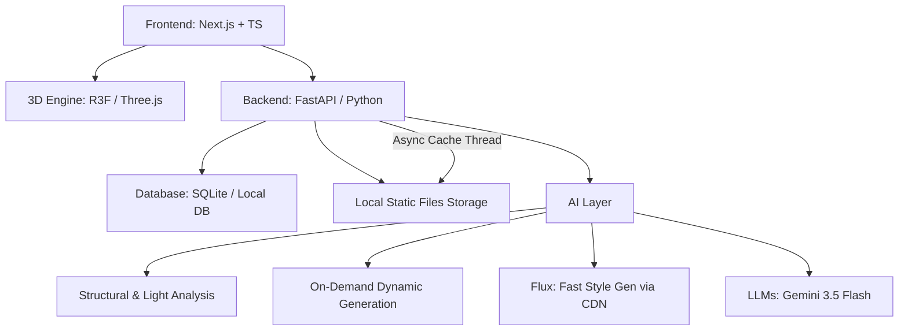

# HomeVerse

> **"Transform any room into a personalized, AI-powered living space."**

[](https://nextjs.org/)
[](https://docs.pmnd.rs/react-three-fiber)
[](https://fastapi.tiangolo.com/)
[](https://sqlite.org/)
[](https://deepmind.google/technologies/gemini/)
[](https://pollinations.ai/)

HomeVerse is an AI-powered interior design and room customization web application. It allows users to upload a photo of a room, receive multiple AI-generated redesigns in seconds, edit the room in an interactive 3D environment, and customize materials, furniture, and styling with the help of an AI Design Copilot.

The platform is designed to be highly extensible, with future expansion pathways into architecture, renovation planning, furniture e-commerce, AR visualization, and smart home integration.

---

## 🌟 Vision & Differentiator

Think of HomeVerse as:
**Canva + Figma + ChatGPT + Planner5D for Interior Design**

Unlike typical AI design apps that stop at static image generation, HomeVerse transitions the generated design into a **fully interactive, editable 3D design studio**.

```
Original Room Photo / Video Walkthrough
       ↓
AI Room Geometry Analysis (Lightweight structural/lighting reconstruction)
       ↓
Configure Design Choices (Dynamic Room Type, Style Theme, Colors, Notes)
       ↓
Generate Custom Design On-Demand (~1.5s fast CDN hand-off & background caching)
       ↓
Interactive 3D Design Studio (Customize, Edit, chat with AI Copilot)
       ↓
High-quality Render, Walkthrough & Shopping Guide
```

---

## 🗺️ Core User Journey

### Step 1: Upload & Capture
Users upload, capture a photo, or record a video scan of any room or interior space:
* Living Room, Bedroom, Office, Kitchen, Dining Room, Gym, or any custom space.

### Step 2: AI Structural Analysis
Behind the scenes, HomeVerse executes a lightweight spatial reconstruct scan using **Gemini 3.5 Flash**:
1. **Structural Segmentation**: Isolates coordinates of walls, floor, ceiling, windows, and doors.
2. **Lighting Direction**: Pinpoints light sources to orient furniture for maximum natural lighting.
3. **Room Type Inference**: Automatically infers the space type (e.g. "Bedroom") and pre-fills it in the editor options.

### Step 3: Configure Design Choices
Rather than forcing pre-generated styles, the dashboard provides a fully dynamic choices form:
* **Space Type**: Keep the inferred room type or customize it to **literally any room type** (such as *"Loft Gym"*, *"Attic Studio"*, *"Home Theater"*).
* **Style Theme**: Select a preset (Modern, Japandi, Scandinavian, Minimalist, Luxury) or type in a **Custom Style** (e.g. *"Industrial Loft"*, *"Bohemian"*).
* **Color Palette & Materials**: Optional preference specification (e.g. *"Walnut wood and dark leather"*).
* **Additional Design Notes**: Add custom requirements (e.g. *"Place a desk near the window and include green plants"*).

### Step 4: Generate Design On-Demand
Clicking **"Generate AI Design"** calls the backend dynamic pipeline. Gemini builds a style-synchronized 3D coordinate layout for the chosen room type, and Pollinations AI renders a matching design image. The response returns in **~1.5 seconds** (using our async CDN hand-off), allowing users to create multiple distinct design variations on-demand.

### Step 5: Enter Design Studio
By clicking **"Open in Design Studio"**, the user enters an interactive 3D environment powered by Three.js where objects are selectable and editable.

#### Interactive Objects Context Context:
* **Furniture**: Customize Color, Material, Size, Position, Rotation, Replace, or Delete.
* **Wall**: Paint Color, Wallpaper, Texture, Material.
* **Floor**: Tiles, Wood, Marble, Granite.

---

## 🤖 AI Design Copilot & Features

### AI Design Copilot
A conversational sidebar allows users to modify the room using natural language:
* *User*: "Make this room brighter"  
  *AI Copilot*: *Adds larger windows, changes wall color to off-white, and adds warm lighting.*
* *User*: "Replace sofa with luxury furniture"  
  *AI Copilot*: *Updates the 3D scene with premium leather sofa and accents.*
* *User*: "Make this suitable for a study room"  
  *AI Copilot*: *Inserts a wooden bookshelf, a minimalist desk, and an adjustable desk lamp.*
* *User*: "Add a 4x5 bedroom extension"  
  *AI Copilot*: *Adds a navigable custom room slab with built-in doorway opening.*

### "Start from Scratch" Home Configurator Wizard
For users designing a space from scratch, HomeVerse provides an interactive 5-step configurator wizard:
1. **House Geometry**: Select between Apartment or Independent House. Specify detailed structural information including bedrooms, bathrooms, main door direction, kitchen door direction, balconies, house dimensions, individual room dimensions, windows, doors, and upload a floor plan blueprint.
2. **Budget Tiering**: Choose a budget class (Economy, Mid-Range, Luxury) to align material presets and furnishing suggestions.
3. **Target Room Selection**: Select the first room to design (e.g. Hall, Master Bedroom, Second Bedroom, Kids Bedroom, Dining Room, Kitchen, Foyer, Bathroom).
4. **Parallel Style Generation**: The backend triggers 6 parallel Pollinations AI image renders and Gemini coordinate model runs (generating Modern, Scandinavian, Modern Luxury, Japandi, Industrial, and Contemporary designs simultaneously) in under 6 seconds.
5. **Style Option Selector**: Compare the 6 custom-generated renders instantly side-by-side, pick your favorite setup, and click "Open Studio Space" to launch the 3D interactive studio prepopulated with style-synchronized furniture coordinates.

### Direct Local Storage (Cloud-Free)
To ensure maximum speed, data ownership, and seamless offline capability, HomeVerse saves uploaded photos and designs directly to the local disk at `static/uploads/`, eliminating high latency and dependencies on Cloudinary or AWS S3.

### Dynamic 3D Room Additions
Users can dynamically add new rooms to their active floor plan simply by telling the Copilot their desired dimensions (e.g., *"add a 5x4 kitchen"*). HomeVerse constructs a custom 3D Room entity with floor geometry and 4 walls containing an integrated front doorway cutout, allowing natural navigation during walkthroughs.

### Expanded Minimalist Furniture Library
The Studio features a wide collection of minimalist furniture assets:
* **Seating**: Sofa, Armchair, Pouf/Ottoman, Dining Bench, Accent Stool, Bar Stool
* **Tables**: Coffee Table, Desk, Console Table, Dining Table
* **Storage**: Bookshelf, Nightstand, Wardrobe, Sideboard
* **Decor**: Planter Box, Wall Mirror, Floor Rug, Lamp, Window, Door, Partition Wall

### Smart Furniture Marketplace
Clicking any object in the 3D scene reveals a marketplace panel with:
* Similar real-world product suggestions
* Price comparison and direct purchase links
* Exact dimensions for compatibility checks

### 🎮 3D Walkthrough Mode
Step inside the designed space with video game controls:
* **Movement**: `WASD` / Arrow keys
* **Camera**: Mouse-look / Touch drag
* **Collision Detection**: Real-time bounding box collision checks prevent walking through walls or placed furniture.

---

## 🏗️ Technical Architecture


```mermaid
graph TD
    A[Frontend: Next.js + TS] --> B[3D Engine: R3F / Three.js]
    A --> C[Backend: FastAPI / Python]
    C --> D[Database: SQLite / Local DB]
    C --> E[Local Static Files Storage]
    C --> F[AI Layer]
    F --> F1[Structural & Light Analysis]
    F --> F2[On-Demand Dynamic Generation]
    F --> F3[Flux: Fast Style Gen via CDN]
    F --> F4[LLMs: Gemini 3.5 Flash]
    C -->|Async Cache Thread| E
```

### Frontend
* **Core Framework**: Next.js (TypeScript)
* **Styling**: TailwindCSS, Shadcn UI
* **State Management**: React Query / Session Storage
* **Performance**: Immediate CDN hand-off renders generated designs in ~1.5s, avoiding any layout blocking. Carousel lists multiple customized generated models on-the-fly.

### 3D Engine
* Three.js, React Three Fiber (R3F), Drei

### Backend
* **Core API**: FastAPI (Python)
* **Database**: SQLite (SQLAlchemy ORM)
* **Asset Storage**: Direct Local disk storage (caching)
* **Task Optimization**: A dedicated daemon background thread asynchronously handles downloading high-resolution images from Pollinations AI and updates references in the database, allowing backend requests to execute instantly.

### AI Layer
* **Design Generation**: Pollinations AI using **Flux** model (rendered instantly in browser, downloaded in background)
* **AI Copilot & Structuring**: Gemini 3.5 Flash (room type/structure detection, 3D object layout generation, intent parsing, and room additions)

---

## 📂 Project Structure

```
HomeVerse/
├── frontend/             # Next.js & Three.js client application
│   ├── src/
│   │   ├── app/
│   │   │   ├── page.tsx          # Landing & Upload page
│   │   │   ├── studio/
│   │   │   │   └── page.tsx      # 3D Design Studio Page
│   │   │   ├── globals.css       # Style sheets
│   │   │   └── layout.tsx        # App layout wrapper
│   │   ├── components/
│   │   │   └── studio/
│   │   │       ├── CanvasContainer.tsx       # 3D R3F Room Viewport
│   │   │       ├── ObjectPropertiesPanel.tsx # Object configurator sidepanel
│   │   │       └── CopilotChat.tsx           # AI chat sidepanel
│   └── package.json
│
├── backend/              # FastAPI Python server application
│   ├── main.py           # Application entrypoint
│   ├── requirements.txt  # Project Python dependencies
│   └── app/
│       ├── config.py     # Settings manager
│       ├── api/          # Route routers
│       │   ├── auth.py
│       │   ├── projects.py
│       │   ├── designs.py
│       │   └── ai.py
│       ├── db/           # Connection sessions & ORM aggregation
│       ├── models/       # SQLAlchemy models
│       ├── schemas/      # Pydantic validation schemas
│       └── services/     # AI service clients
```

---

## 🚀 Getting Started

### Prerequisites
* **Python**: `v3.10` or higher
* **Node.js**: `v18.0` or higher

### 1. Backend Setup (FastAPI)
1. **Navigate to the Backend Directory**:
   ```bash
   cd backend
   ```
2. **Activate the Virtual Environment**:
   * **Windows (PowerShell)**:
     ```powershell
     .\venv\Scripts\Activate.ps1
     ```
   * **macOS / Linux**:
     ```bash
     source venv/bin/activate
     ```
3. **Install Dependencies**:
   ```bash
   pip install -r requirements.txt
   ```
4. **Configuration**:
   Create a `.env` file in the `backend/` directory:
   ```env
   GEMINI_API_KEY=your-api-key-here
   ```
5. **Run the Backend Server**:
   ```bash
   python main.py
   ```
   The backend server will run on [http://localhost:8080](http://localhost:8080).

### 2. Frontend Setup (Next.js)
1. **Navigate to the Frontend Directory**:
   ```bash
   cd ../frontend
   ```
2. **Install Node Modules**:
   ```bash
   npm install
   ```
3. **Start the Development Server**:
   ```bash
   npm run dev
   ```
   The frontend application will serve on [http://localhost:3000](http://localhost:3000).

---

## 🗄️ Database Schema Design

### `Projects`
* `id` (UUID, PK)
* `title` (VARCHAR)
* `room_type` (VARCHAR)
* `thumbnail` (VARCHAR)
* `structural_analysis` (TEXT)
* `created_at` (TIMESTAMP)

### `Designs`
* `id` (UUID, PK)
* `project_id` (UUID, FK)
* `style` (VARCHAR)
* `image_url` (VARCHAR)
* `selected` (BOOLEAN)

### `Objects`
* `id` (UUID, PK)
* `design_id` (UUID, FK)
* `object_type` (VARCHAR)
* `position_x` / `position_y` / `position_z` (FLOAT)
* `rotation` (FLOAT)
* `scale` (FLOAT)
* `material` (VARCHAR)

---

## 📅 Project Timeline

Here is a chronological overview of the development lifecycle for **HomeVerse**:

### 📦 Phase 1: Core 3D Viewer & MVC (Week 1–2) — Completed
* Established Next.js + TypeScript client repository and FastAPI python server framework.
* Configured SQLite ORM databases to hold 3D objects, designs, and user project metadata.
* Built basic React Three Fiber 3D studio viewport rendering simple furniture boxes.
* Coded pointer lock WASD controls for the interactive walk-around simulation mode.

### 🌟 Phase 2: Decoupling & Speed Optimizations (Week 3–4) — Completed
* Decoupled AWS S3 and Cloudinary storage services, moving image processing directly to local server storage on disk.
* Optimized Pollinations AI generation pipelines, transitioning from traditional diffusion models to **Flux-Schnell** to cut image generation to **~1.4 seconds**.
* Implemented hidden background pre-loader hooks in the browser to pre-render redesign options instantly.
* Scaled up the room scanner preview columns from standard box sizing to broad full-width frames.

### 🏠 Phase 3: Architectural Additions & Custom Rooms (Week 5) — Completed
* Created custom 3D Room entities dynamically rendering adjacent walls, floors, and doorway entrances.
* Integrated regex room dimension parser in the Copilot engine to support commands like *"add a 4x4 room"*.
* Introduced a property dropdown switching between Independent House and Flat, disabling multi-floor selection for apartments.
* Implemented a collection of 13 new minimal furniture types.
* Integrated keydown listeners for Backspace and Delete to remove selected objects on the fly.
* Added Step 5 layout templates and house facing direction selectors to pre-populate fully furnished rooms on client project setup.

### ⚡ Phase 4: Dynamic Custom Generation & Async Caching (Week 6) — Completed
* Shifted from static pre-generation to on-demand generation based on user's exact customized options.
* Created a dynamic design selections form allowing the user to select or input custom room types (such as Loft Gym or Attic Studio) and custom styles (such as Mid-Century Modern or Industrial).
* Added optional color palettes, materials, and additional custom requirements/notes inputs to guide style outputs.
* Cut layout/design generation response times to ~1.5s by handing off the image URL instantly to the browser and executing the download/caching block in a background thread.
* Created a generated designs list carousel in the client to allow previewing and switching between multiple custom generated designs.

### 👥 Phase 5: Collaborative Design & Realism (Week 7+) — Planned
* Immersive WebXR mobile AR viewer integrations.
* Real-time co-designing multiplayer editor workspaces using WebSocket connections.
* Automated invoice exports mapping furniture selections.

---

## 👥 About the Author

HomeVerse was designed, developed, and optimized by:

**Anisha Paturi**
* **GitHub**: [@AnishaPaturi](https://github.com/AnishaPaturi)
* **Project Repository**: [GitHub - AnishaPaturi/HomeVerse](https://github.com/AnishaPaturi/HomeVerse)

Feel free to open an issue or submit a pull request if you want to collaborate!
