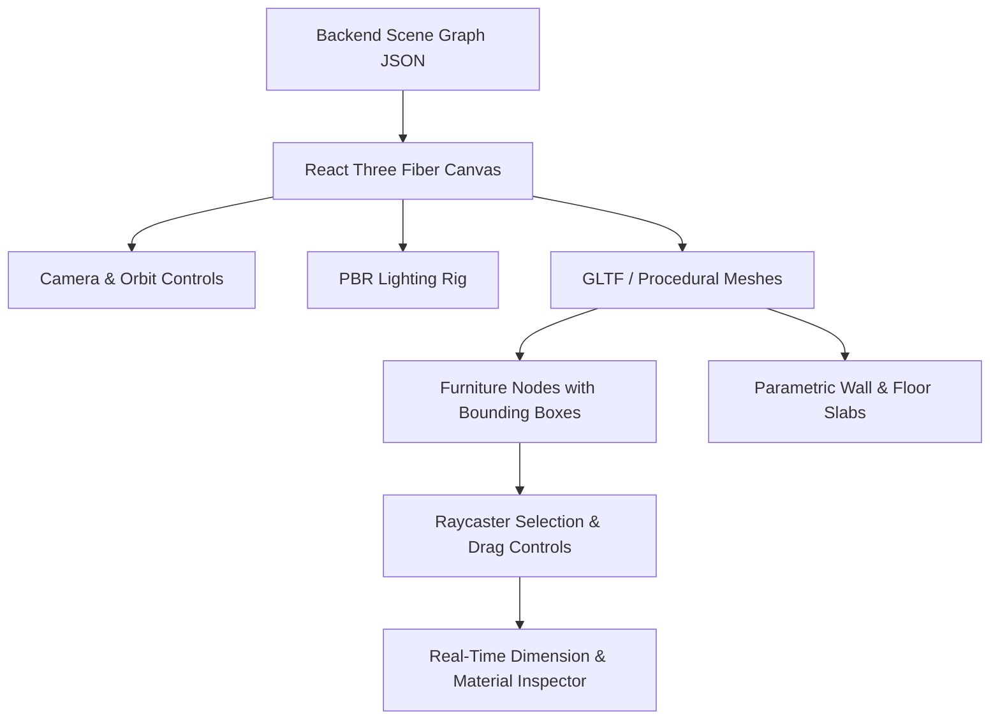

# 3D Engine & WebGL Architecture

## 1. Overview
HomeVerse uses a client-side WebGL rendering architecture powered by Three.js and React Three Fiber (R3F), delivering 60 FPS spatial manipulation directly in modern web browsers without native software installations.

## 2. Key Engine Features
- **PBR (Physically Based Rendering)**: Accurate roughness, metallic, and normal maps reflecting real architectural materials.
- **Parametric Meshes**: Instant procedural generation of room boundaries, baseboards, trims, doors, and windows based on detected dimensions.
- **Bounding Box Collision Detection**: Evaluates ergonomics and ensures minimum 80cm clear walkway pathways across doors and primary circulation axes.
- **Multi-Level Cutaway Viewing**: Supports whole-house exploded view and floor-by-floor section slicing.
