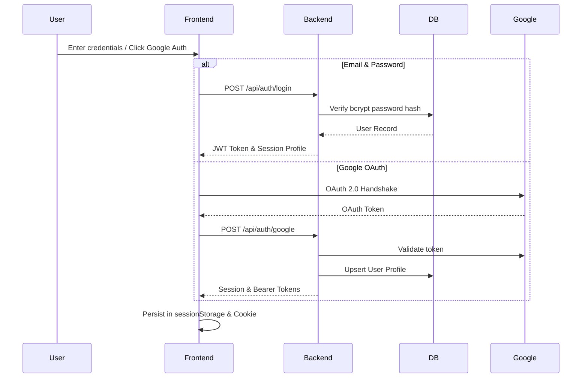

# Authentication Architecture

## 1. Overview
HomeVerse supports a hybrid authentication layer allowing frictionless access for homeowners, design studios, and enterprise contractors.

## 2. Token Specification & Security
- **Algorithm**: HMAC SHA-256 (HS256)
- **Token Expiry**: Access Token (24 hours), Refresh Token (7 days)
- **RBAC**: Standard Homeowner (`homeowner`), Pro Designer (`designer`), Admin (`admin`).
- **Demo Mode**: Instant 1-click profiles for testing and continuous evaluation without database lockouts.
