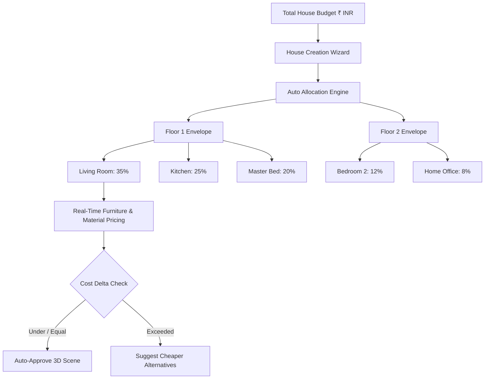

# Budget Architecture & Value Engineering

## 1. Overview
The HomeVerse budget subsystem ensures that all designs, material finishes, and spatial configurations operate within realistic financial parameters established at the outset of house creation.

## 2. Flexibility Constraints
- **Strict**: Budget cannot exceed target by even 1%. Recommendations favor cost-effective catalog alternatives (e.g. IKEA, Urban Ladder).
- **Moderate**: Up to 10% variance permitted if design longevity or material durability increases substantially.
- **Flexible**: Priority is maximum aesthetic and bespoke craftsmanship; alerts are informational rather than blocking.

## 3. Database Schema
- **Budget**:
  - `total_budget`: Numeric(12, 2)
  - `currency`: String(3) [Default: "INR"]
  - `flexibility`: String(20) ["strict" | "moderate" | "flexible"]
  - `spent_amount`: Numeric(12, 2)
  - `estimated_amount`: Numeric(12, 2)
  - `remaining_amount`: Numeric(12, 2)
- **BudgetAllocation**:
  - `budget_id`: UUID
  - `floor_id`: UUID (optional)
  - `room_id`: UUID (optional)
  - `category`: String(50) (e.g., "Furniture & Seating", "Civil & Flooring")
  - `allocated_amount`: Numeric(12, 2)
  - `actual_amount`: Numeric(12, 2)
