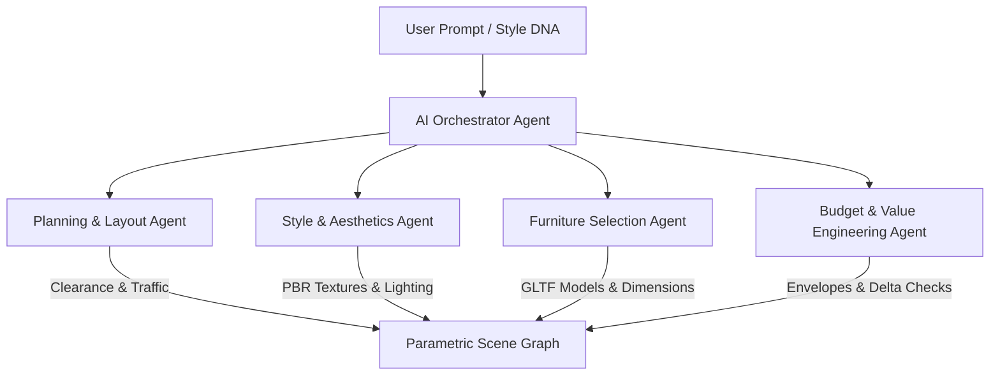

# Design AI & Multi-Agent Architecture

## 1. Overview
HomeVerse uses specialized AI agents collaborating under an orchestrator to generate cohesive, ergonomically sound, and financially calibrated room designs.

## 2. Core Curated Design DNA Profiles
1. **Japandi**: Bleached white oak, wabi-sabi linen, washi paper pendant lighting, warm limestone.
2. **Modern**: Dark smoked walnut, matte black metal accents, smoked glass, seamless concrete.
3. **Scandinavian**: Light birch wood, plush bouclé wool, maximized natural daylight, minimal hardware.
4. **Modern Luxury**: Bookmatched Calacatta marble, brushed brass trims, emerald Italian velvet, architectural cove LEDs.
5. **Industrial**: Exposed brickwork, antique cognac leather, black cast iron framing, polished warehouse screed.
6. **Contemporary**: Curvaceous sculpted bouclé sofas, honed travertine stone, warm taupe palettes.

## 3. Real-Time Conversational Copilot
Users can query the Copilot with natural commands:
- "Make this room warmer" -> Replaces cool lighting with 2700K ambient lumens and warms wall paint.
- "Optimize layout for entertaining" -> Reorients seating toward the focal conversation area while preserving an 80cm walking clearance.
