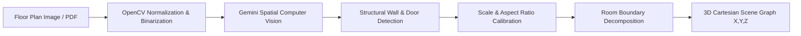

# Floor Plan Analysis & Spatial AI Pipeline

## 1. Overview
The HomeVerse Floor Plan AI pipeline transforms architectural drawings, PNG/JPG scans, or mobile photos into structured CAD boundaries and room bounding boxes.

## 2. Core Detection Capabilities
- **Wall Bounding**: Identifies load-bearing outer perimeters and interior non-structural partitions.
- **Openings**: Distinguishes between standard swing doors, sliding doors, French windows, and fixed window glass.
- **Metric Scaling**: Uses reference scale bars or default doorway widths (0.9m) to calculate exact square meterage ($m^2$) and square footage ($sq ft$).
- **Dimension Calibration**: Allows homeowners to override widths and lengths in the wizard UI with instant recalculation of polygon vertices.
