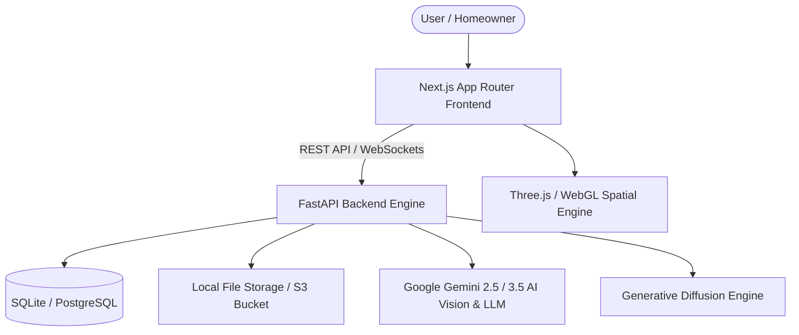

# HomeVerse System Architecture

## 1. Overview
HomeVerse is an AI-native spatial CAD and interior architecture operating system designed to turn real-world house constraints, floor plans, and financial budgets into interactive 3D digital twins before spending capital.

## 2. Core Architectural Principles
1. **Budget as a First-Class Citizen**: The budget is captured during house creation and actively guides AI spatial recommendations, material grades, and furniture selections.
2. **Deterministic Spatial CAD**: 3D coordinates, walls, clearances, and physics boundaries are locked; AI generates aesthetic variations while strictly preserving Cartesian bounds ($X, Y, Z$).
3. **Atomic Multi-Floor Hierarchy**: Projects follow a strict `Project -> Floor -> Room -> Scene -> SceneObject` hierarchy created in atomic database transactions.
4. **Value-Engineering Engine**: Any design modification (e.g., resizing furniture, swapping upholstery) instantly calculates cost deltas against Indian Rupee (₹) benchmarks.

## 3. Technology Stack
- **Frontend**: Next.js 16 (App Router), React 19, TypeScript 5, Tailwind CSS 4, Three.js, React Three Fiber, React Three Drei, Lucide React, Zustand, Axios.
- **Backend**: Python 3.11+, FastAPI, SQLAlchemy ORM, Pydantic v2, SQLite / PostgreSQL, OpenCV, NumPy.
- **AI & Vision**: Google Gemini 2.5/3.5 Flash & Pro Vision APIs, Spatial Prompt Orchestration, Multi-Agent Collaboration.
- **Storage**: Unified abstraction supporting local disk storage and AWS S3/Cloudflare R2.
