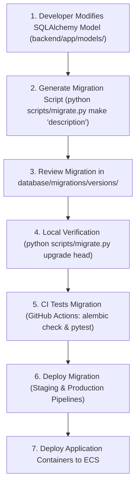

# HomeVerse Database Migration Workflow (Phase 37)

This document establishes the official database schema management standards using **Alembic**.

> [!CAUTION]
> **Golden Rule of Database Operations:**
> **Never manually edit production tables.** All DDL changes (creating tables, altering columns, adding indexes, removing foreign keys) MUST be performed via tracked Alembic migration scripts.

---

## 1. The Migration Lifecycle



---

## 2. CLI Migration Commands

Use the unified, cross-platform CLI tool:

```bash
# Check current database revision and available heads
python scripts/migrate.py status

# Verify if SQLAlchemy models match the database schema without pending diffs
python scripts/migrate.py check

# Generate a new autogenerated migration after modifying SQLAlchemy models
python scripts/migrate.py make "add floor plan metadata columns"

# Apply all pending migrations to the latest revision
python scripts/migrate.py upgrade head

# Roll back the most recent migration
python scripts/migrate.py downgrade -1
```

---

## 3. Step-by-Step Developer Guide

### Step 1: Modify SQLAlchemy Models
Make model adjustments in [`backend/app/models/`](file:///C:/Users/anish/OneDrive/College/Projects/HomeVerse/backend/app/models/) (e.g., adding an attribute, updating a foreign key, or defining a new entity).

### Step 2: Create Migration Script
Run the generator:
```bash
python scripts/migrate.py make "describe your change"
```
Alembic will inspect `Base.metadata` and autogenerate a revision script in [`database/migrations/versions/`](file:///C:/Users/anish/OneDrive/College/Projects/HomeVerse/database/migrations/versions/).

### Step 3: Review Generated Migration
Inspect the newly created file. Verify:
- Both `upgrade()` and `downgrade()` functions are present and symmetric.
- Any SQLite batch operations use `with op.batch_alter_table(...)`.
- Column data types are appropriate for both PostgreSQL and SQLite.

### Step 4: Run Automated Tests
```bash
pytest backend/tests/integration/test_migrations.py -v
```

### Step 5: Commit & Pull Request
Commit the model changes and the migration file in the same Git commit:
```bash
git add backend/app/models/ database/migrations/versions/
git commit -m "feat(db): add floor plan metadata columns"
```

---

## 4. Pipeline Integration & Safety
- **CI Safety Gate**: The GitHub Actions backend CI pipeline runs `alembic upgrade head` and `alembic check` on every pull request. If a model was modified without a corresponding migration, CI immediately fails.
- **Pre-Deployment Execution**: The Continuous Delivery pipeline automatically applies `python scripts/migrate.py upgrade head` to the target database before triggering rolling container updates to AWS ECS.
