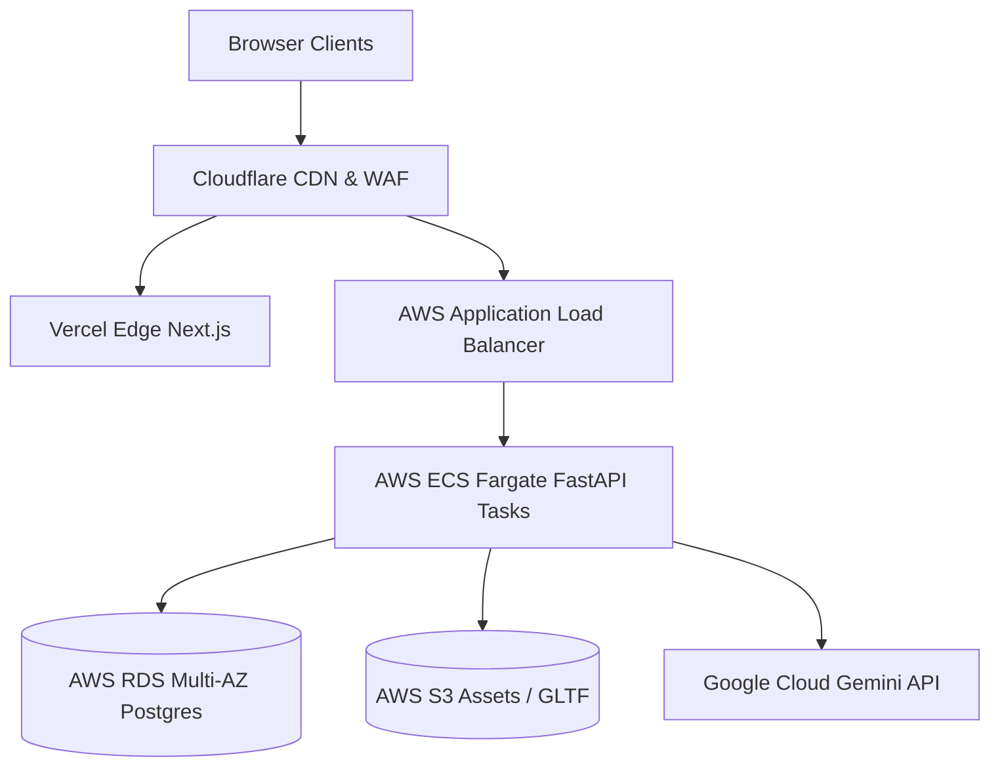

# Production Deployment & Infrastructure Runbook

## 1. Overview
The HomeVerse production environment is designed for high-availability spatial 3D rendering and compute-intensive computer vision pipelines.



## 2. Production Health Checks
- `GET /health`: Comprehensive backend status including DB connectivity.
- `GET /api/v1/ping`: Fast liveness probe.

## 3. Database Migration Runbook
In production, database migrations should be executed using Alembic:
```bash
# Verify current migration status
alembic current

# Run migrations
alembic upgrade head
```

## 4. Monitoring & Alerting
- Sentry for client-side WebGL & server-side runtime exceptions.
- Prometheus & Grafana for API request latency and AI diffusion queue depths.
- CloudWatch alarms on CPU > 80% or memory exhaustion.
