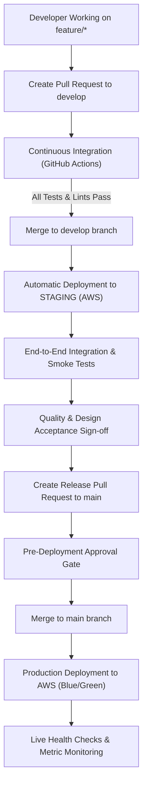

# HomeVerse Environment Architecture & Promotion Flow (Phase 35)

This document formalizes the three deployment environments for the HomeVerse platform, their underlying infrastructure topology, security boundaries, and promotion lifecycle.

---

## 1. Environments Overview

| Attribute | 1. Development | 2. Staging | 3. Production |
|---|---|---|---|
| **Target Platform** | Local Docker / Compose | Amazon Web Services (AWS) | Amazon Web Services (AWS) |
| **Branch** | `feature/*`, `bugfix/*` | `develop` | `main` |
| **Compute** | Docker Containers (hot-reload) | AWS ECS Fargate (`10.1.0.0/16`) | AWS ECS Fargate Multi-AZ (`10.2.0.0/16`) |
| **Database** | Local PostgreSQL / SQLite | AWS RDS PostgreSQL (Single-AZ) | AWS RDS PostgreSQL (Multi-AZ, gp3, encrypted) |
| **Cache / Queue** | Local Redis 7 | AWS ElastiCache Redis 7 | AWS ElastiCache Redis 7 Cluster |
| **Object Storage** | Local / Dev S3 Bucket | S3 (`homeverse-uploads-staging`) | S3 (`homeverse-uploads-production`) |
| **CDN / Edge** | Direct (`localhost:3000`) | Amazon CloudFront (Staging) | Amazon CloudFront (Global CDN with SSL) |
| **API Endpoint** | `http://localhost:8080` | `https://api-staging.homeverse.ai` | `https://api.homeverse.ai` |
| **Web Endpoint** | `http://localhost:3000` | `https://staging.homeverse.ai` | `https://homeverse.ai` |

---

## 2. Promotion & Deployment Flow



---

## 3. Environment Specifics

### A. Development (Local Docker)
- **Goal**: Zero-latency local developer experience.
- **Run command**:
  ```bash
  docker compose -f docker-compose.yml -f docker-compose.dev.yml up
  ```
- **Live Reload**: Source directories (`backend/` and `frontend/`) are mounted into containers for instant feedback without container rebuilding.

### B. Staging (AWS)
- **Goal**: High-fidelity pre-production replica for smoke tests and user acceptance testing.
- **Trigger**: Automatic on merge to `develop`.
- **Infrastructure**: Provisioned via Terraform using `infrastructure/terraform/environments/staging.tfvars`.

### C. Production (AWS)
- **Goal**: High availability, multi-AZ resilience, sub-second response times, and automated disaster recovery.
- **Trigger**: Merge to `main` with manual promotion gate.
- **Infrastructure**: Provisioned via Terraform using `infrastructure/terraform/environments/production.tfvars`.

---

## 4. Secret & Configuration Management

1. **Local Development**: Configured via `.env.development` or `.env.local`.
2. **CI/CD Pipelines**: Managed via GitHub Repository Secrets (`AWS_ACCESS_KEY_ID`, `AWS_SECRET_ACCESS_KEY`, `AWS_REGION`, `AWS_ECR_REGISTRY`).
3. **AWS Staging & Production**: Secrets are stored in **AWS Secrets Manager** and injected into ECS Fargate task definitions at runtime via IAM execution role permissions.
