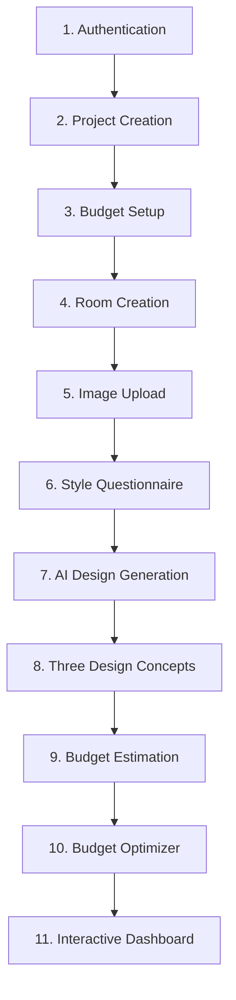

# HomeVerse MVP Architecture & Core Features (Phase 47)

This document formalizes the architecture, boundaries, and validation of the **Minimum Viable Product (MVP)** for HomeVerse as outlined in **Phase 47** of `IMPLEMENTATION_PLAN.md`.

---

## 1. MVP Scope & Philosophy

> "DO NOT build everything initially. MVP should be fully functional before adding advanced features."

HomeVerse is an AI-powered home design, budgeting, and execution platform. To achieve product-market fit and ensure rock-solid stability, the MVP deliberately scopes down to **11 core, cohesive capabilities** covering the complete user journey from an empty apartment to a completed home dossier.

---

## 2. The 11 Core MVP Features

### Feature 1: Authentication
- **Purpose**: Secure client access, account management, and user data isolation.
- **Backend**: `app/api/auth.py`, `app/api/users.py`, `app/core/security.py`.
- **Endpoints**: `POST /api/auth/register`, `POST /api/auth/login`, `GET /api/users/me`.
- **Security**: Argon2/Bcrypt password hashing, JWT Bearer tokens, CSRF protection.

### Feature 2: Project Creation
- **Purpose**: Establishes the residential spatial identity and specifications.
- **Backend**: `app/api/projects.py`.
- **Endpoints**: `POST /api/projects`, `GET /api/projects`, `GET /api/projects/{id}`.
- **Canonical Setup**: 2 BHK, 1,120 sq ft apartment, target budget ₹8,00,000 INR.

### Feature 3: Budget Management
- **Purpose**: Initializes and tracks total project budget, allocations, and remaining balances.
- **Backend**: `app/api/budget.py`, `app/models/budget.py`.
- **Endpoints**: `GET /api/budget/{project_id}`, `PUT /api/budget/{project_id}`.
- **Formula**: `remaining_amount = total_budget - spent_amount`.

### Feature 4: Room Creation
- **Purpose**: Defines spatial room zones and vector boundary dimensions.
- **Backend**: `app/api/rooms.py`, `app/models/room.py`.
- **Endpoints**: `POST /api/projects/{project_id}/rooms`, `POST /api/rooms`, `GET /api/projects/{project_id}/rooms`.
- **Attributes**: Room name, room type, length (m), width (m), area (sq ft), status.

### Feature 5: Image Upload
- **Purpose**: Secure intake of floor plans, spatial blueprints, and site photographs.
- **Backend**: `app/api/uploads.py`.
- **Endpoints**: `POST /api/uploads`.
- **Security**: Extension validation (`.png`, `.jpg`, `.jpeg`, `.webp`, `.pdf`), unique UUID naming, size caps.

### Feature 6: Style Questionnaire
- **Purpose**: Establishes the client's aesthetic DNA and lifestyle persona.
- **Backend**: `app/api/preferences.py`, `app/models/user.py`.
- **Endpoints**: `POST /api/preferences/{user_id}`, `GET /api/preferences/{user_id}`.
- **Canonical Result**: Style: *Warm Contemporary*, Palette: *Neutral, Warm Wood, Cream*, Materials: *Oak, Boucle, Linen*.

### Feature 7: AI Design Generation
- **Purpose**: Generates contextually aware spatial concepts from room boundaries and style DNA.
- **Backend**: `app/api/ai.py`, `app/services/ai_generation.py`.
- **Endpoints**: `POST /api/ai/generate-dynamic-design`, `POST /api/ai/generate-design`.
- **Capabilities**: Raytraced photorealistic perspectives with locked coordinate boundaries.

### Feature 8: Three Design Concepts & Selection
- **Purpose**: Empowers resident decision-making through side-by-side concept comparison.
- **Backend**: `app/api/designs.py`.
- **Endpoints**: `POST /api/designs/{design_id}/select`, `GET /api/projects/{project_id}/designs`.
- **Concepts**: Design A (Scandinavian - ₹8.4L), Design B (Warm Contemporary - ₹8.4L), Design C (Modern Luxury - ₹8.9L). Selection of Design B unselects sibling options.

### Feature 9: Budget Estimation
- **Purpose**: Accurate, itemized cost estimation per room and furniture piece.
- **Backend**: `app/api/designs.py:get_design_cost_breakdown`, `app/api/budget.py:get_project_design_costs_endpoint`.
- **Endpoints**: `GET /api/designs/{design_id}/cost`, `GET /api/budget/{project_id}/design-costs`.
- **Formula**: `total_cost = sum(quantity * unit_cost)`.

### Feature 10: Budget Optimizer ("Make It Fit ₹8L")
- **Purpose**: Value-engineering engine reducing proposed costs to meet budget ceiling without aesthetic sacrifice.
- **Backend**: `app/api/budget.py:optimize_project_budget`, `app/api/ai.py:simulate_what_if_scenario`.
- **Endpoints**: `POST /api/budget/{project_id}/optimize`, `POST /api/ai/what-if/simulate`.
- **Canonical Outcome**: Initial ₹8,40,000 &rarr; Optimized **₹7,96,000** (**₹44,000 savings** achieved).

### Feature 11: Frontend Dashboard & Digital Home Book
- **Purpose**: Real-time project command center and verified completion dossier.
- **Frontend**:
  - `frontend/src/app/dashboard/page.tsx`: MY HOME overview, progress metrics (Design 80%, Project 70%), room checklist, next decision interactive prompt.
  - `frontend/src/app/project/[projectId]/home-book/page.tsx`: Digital Home Book dossier with print/PDF export and certificate of completion.
- **Backend**: `GET /api/projects/{project_id}/digital-home-book`.

---

## 3. Verification & Test Suite

The entire 11-feature MVP flow is verified by integration tests in `backend/tests/core/test_mvp_flow.py`:

| Test Case | Feature Validated | Status |
|---|---|---|
| `test_mvp_feature_1_authentication` | Register, Login, JWT Token Issuance | PASS |
| `test_mvp_feature_2_project_creation` | 2 BHK, 1120 sqft, ₹8L budget project creation | PASS |
| `test_mvp_feature_3_budget_setup` | Total and remaining budget initialization | PASS |
| `test_mvp_feature_4_room_creation` | Room dimensions and spatial boundary storage | PASS |
| `test_mvp_feature_5_image_upload` | Floor plan upload and validation | PASS |
| `test_mvp_feature_6_style_questionnaire` | Aesthetic & lifestyle preference profile | PASS |
| `test_mvp_features_7_and_8_three_concepts_and_selection` | 3 concepts generation & Design B selection | PASS |
| `test_mvp_feature_9_budget_estimation` | Itemized cost formula `qty * unit_cost` | PASS |
| `test_mvp_feature_10_budget_optimizer` | ₹8.4L &rarr; ₹7.96L optimization (₹44k savings) | PASS |
| `test_mvp_feature_11_dashboard_and_home_book` | Aggregated dossier and completion certificate | PASS |
