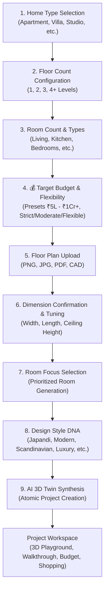

# HomeVerse Product User Flow

## 1. End-to-End User Journey
HomeVerse guides homeowners from initial intent to actionable procurement through 9 structured steps:

## 2. In-Studio Experience
Once inside the workspace:
1. **Interactive 3D Playground**: Move furniture, test clearances, and converse with the AI Copilot.
2. **Budget Delta Alerts**: Modifying an item displays instant cost impacts (e.g. `+₹35,000`) and suggests value-engineering alternatives.
3. **Whole-House Walkthrough**: Switch between floor levels and inspect spatial connections in first-person mode.
4. **Itemized Procurement**: Review the bill of materials, swap products, and click direct vendor purchase links.
